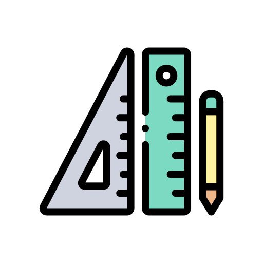

  

  
  
  
  
  

## Tentang School Programs 
Kami pengembang teknologi yang berkomitmen meretas masa depan melalui inovasi teknologi untuk solusi tantangan global. Kami siap memimpin perubahan melalui riset, pengembangan, dan implementasi teknologi terdepan.

Pada intinya, kami adalah tim pengembang, dan siswa yang bersemangat yang berdedikasi untuk membantu pengguna mempelajari pemrograman dengan mudah. Misi kami adalah menyediakan sumber daya pemrograman yang akurat, praktis, dan mudah dipahami sehingga memungkinkan pengguna kami memasuki pasar kerja dengan percaya diri.

## Cara kontribusi
Anda ingin menyumbangkan tulisan? Baguslah kalau begitu. Caranya gampang,

1. [Fork](https://github.com/Julius-Ulee/School-Programs/fork) repository ini menjadi repository Anda sendiri
2. Clone ke local untuk diedit
3. Editlah sesuka hati
4. Commit dan push ke repository Anda sendiri
5. Kirim pull request ke saya dan jelaskan apa saja yang ditambah supaya bisa saya merge ke repository saya

Lihat lebih lanjut agar Anda bisa [configurasi](https://mmistakes.github.io/minimal-mistakes/docs/configuration/).

## License

- Code: [MIT license](https://opensource.org/licenses/MIT).
